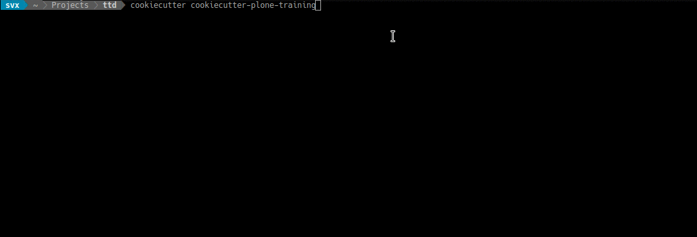
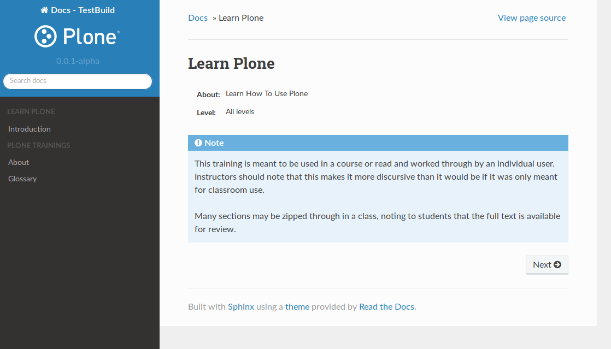

===========================
Cookiecutter Plone Training
===========================

`Cookiecutter <https://cookiecutter.readthedocs.io/en/latest/>`_ Templates for Plone Training Documentation Boilerplate.

Features
========

Creates a training documentation base structure (boilerplate) with the following items:

- index.rst with ``toc``
- glossary,rst with examples
- intro.rst
- conf.py
- _static directory
- _template directory

Example
=======

Installation
============

Please make sure that you have `Cookiecutter <https://cookiecutter.readthedocs.io/en/latest/>`_ installed.

In case you need to install, please follow the `installation docs <https://cookiecutter.readthedocs.io/en/latest/installation.html>`_.

Usage
=====

Grab the template by cloning it

.. code-block:: console

   git clone https://github.com/testthedocs/cookiecutter-plone-training

Then generate your project from the project template

.. code-block:: console

   cookiecutter cookiecutter-plone-training

Contribute
==========

- `Issue Tracker <https://github.com/ttd/cookiecutter-plone-training/issues>`_
- `Source Code: <https://github.com/ttd/cookiecutter-plone-training/>`_

Support
=======

If you are having issues, please let us know.

License
=======

The project is licensed under the GPLv2.
